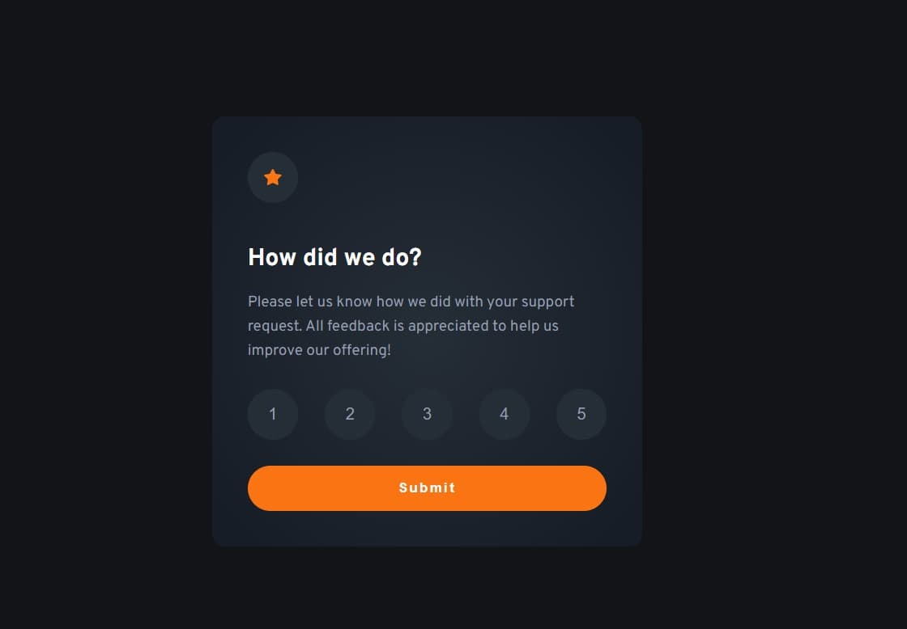
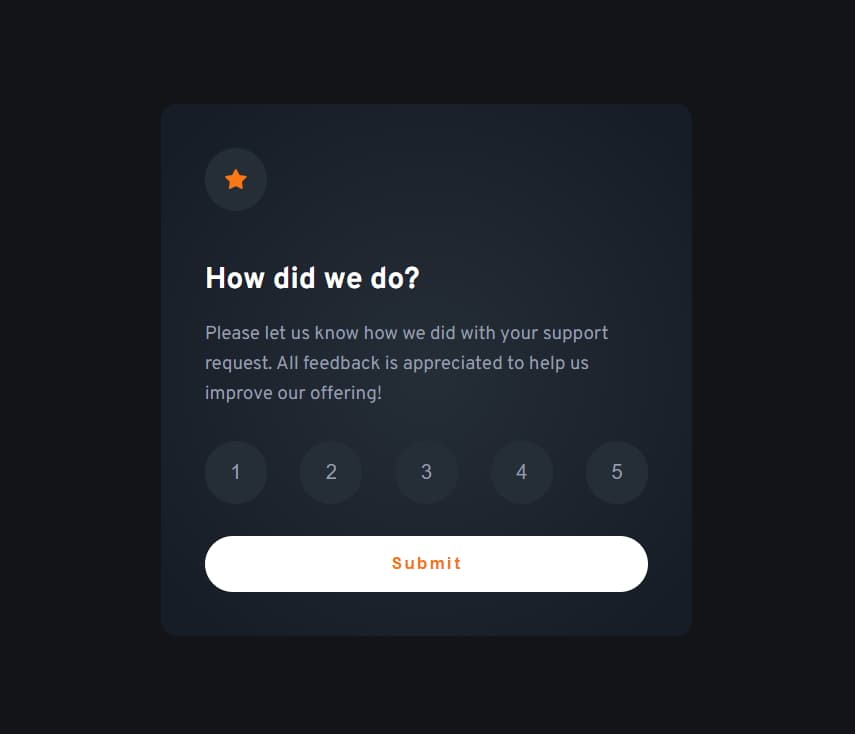

# Frontend Mentor - Interactive rating component solution

This is a solution to the [Interactive rating component challenge on Frontend Mentor](https://www.frontendmentor.io/challenges/interactive-rating-component-koxpeBUmI). Frontend Mentor challenges help you improve your coding skills by building realistic projects. 

## Table of contents

- [Overview](#overview)
  - [The challenge](#the-challenge)
  - [Screenshot](#screenshot)
  - [Links](#links)
- [My process](#my-process)
  - [Built with](#built-with)
  - [Continued development](#continued-development)
  - [Useful resources](#useful-resources)
- [Author](#author)
- [Acknowledgments](#acknowledgments)

**Note: Delete this note and update the table of contents based on what sections you keep.**

## Overview

### The challenge

Users should be able to:

- View the optimal layout for the app depending on their device's screen size
- See hover states for all interactive elements on the page
- Select and submit a number rating
- See the "Thank you" card state after submitting a rating

### Screenshot

### Links

- Solution URL: [My solution](https://github.com/curtisdhenley/Interactive-rating-component)
- Live Site URL: [My live version](https://curtisdhenley.github.io/Interactive-rating-component/)

### Built with

- Semantic HTML5 markup
- CSS custom properties
- Flexbox
- Vanilla ES6 JavaScript
- Mobile-first workflow

### Continued development

This challenge really made me struggle with understanding positioning of elements. After all the tinkering and thinking I had to do, it really showed me that I need to work more on my CSS and design.

## Author

- Website - [Curtis Henley](https://curtisdhenley.github.io/Bootstrap-portfolio/)
- Frontend Mentor - [@curtisdhenley](https://www.frontendmentor.io/profile/curtisdhenley)
- LinkedIn - [Connect with me](https://www.linkedin.com/in/curtisdhenley/)

## Acknowledgments

Hats off to [Ernesto Borges](https://github.com/ernestoborges) as his solution was, in my opinion, immaculate and I would refer to it when stuck.
